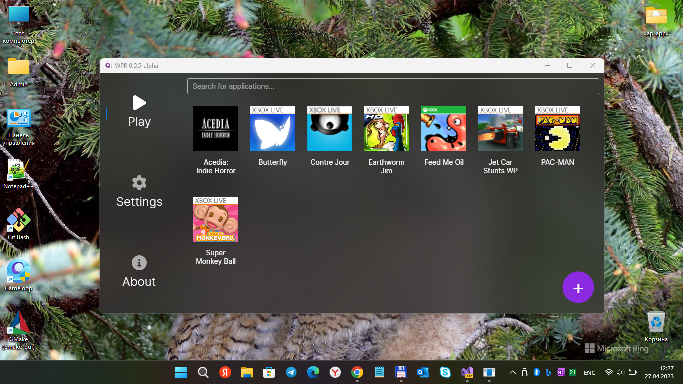
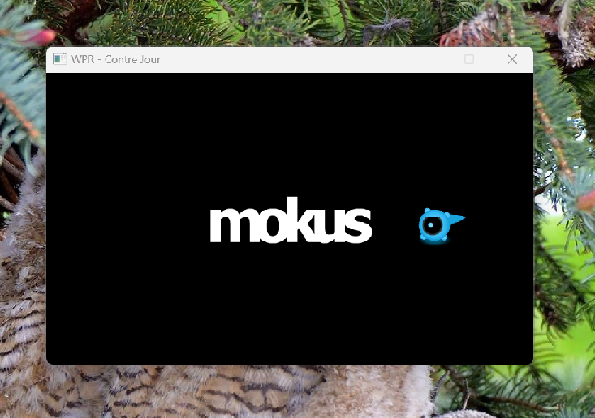
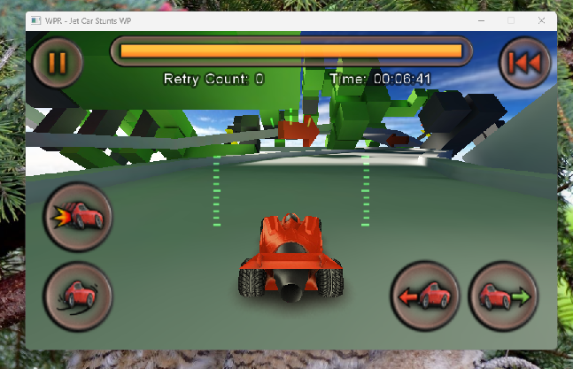
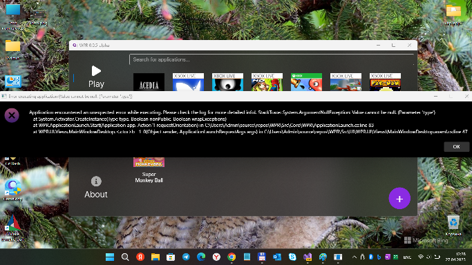

# WPR 0.0.5-alpha :: DEVELOPER EDITION ::

WPR is a WP7-8 XNA app runner. This is only fork of [WPR](https://github.com/8212369/WPR), not the original. 

This is only my little "Avalonia Android/Desktop framework" research + micro-development (or re-development?)))

## "User" Features

- Installing WP7-8 **decrypted** XNA XAPs locally on your machine. Most encripted XAP files are unusable :(
- Earning achievements locally for Xbox Live games, with a pop-up appear everytime achievement is unlocked. :)

## "Dev" Features
- Extended error logging
- Some code stability improved 
- System.Security.Cryptography "emulation" added (I noticed it needed for Countre Jour game...)

## Screenshot(s)









## My little RnD / experiments

- More installed mini-games can start now... but not all... ehhhh! )
- Last WPR Desktop "dirty bugfixes" transferred (sync-ed) to WPR Android
- Zuma and Earthworm Jim game running ok at now... but some artifacts still present ;)

    
## Building 

### Windows (Desktop) target  

- I used the newest VS 2022 Preview to build this super-hard src code
- Build these libraries and place them under the same folder as the executable
- Place FFMPEG executable (you can download from their website or make a custom version with WMA->OGG conversion supported)
- Beside submodules included in this repostiory, this application depends on these native DLLs:
    * FNA3D
    * FAudio
    * libtheorafile 

### Android target 

- I also used the newest VS 2022 Preview to build this mind-blowing code. Plus I installed "Avalonia" extension from VS Marketplace (maybe, it could help to "auto-bind/auto-recompile java deals".. who knows?)))
- I "lost" all my code fixes because of I repeat to fork the original WPR (with ALL java bindings). I use this command (at cmd line):
```
git clone --recursive https://github.com/8212369/WPR
```
- I specially deleted .gitmodules file for reducing the problems when I'll be upload the result onto GitHub repo.
- Before building I check that .NET 6 installed (recovered by VS) in my system.


## TODO

- Stabilize app running
- Add XBOX Live "emulation" to XNA
- Fix Butterfly patching
- Fix FeelMeOil & Contre Jour (and other similar games) running because of only "start screen" appearing at now 
- ? (idk what is in your brave mind))  
    
## This runner existence :: words from the [author/owner/main developer](https://github.com/8212369/) 

" It's for fun. If you are nostaglia mostly about achievements earning like me, you can try it out. There are some old games that is not released on Android or iOS, or some games that seems superior than Android or iOS version (I prefer Skulls of the Shogun on WP actually).
 However, resolution scaling is not yet implemented (game renders either in 480x800 or so...), but it's fun!" :: Lin Yan (8212369)


## :: ::

AS IS. No support. Developers / Geeks only. "DIY mode"


## ::

[m][e] 2023

